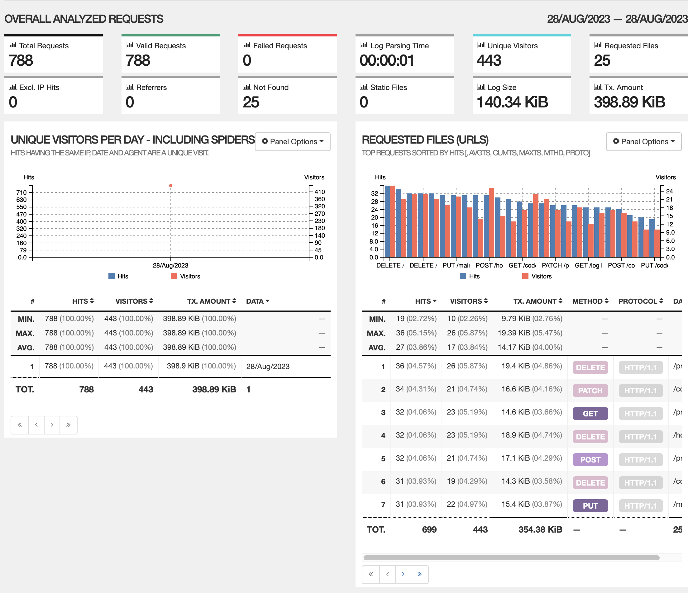
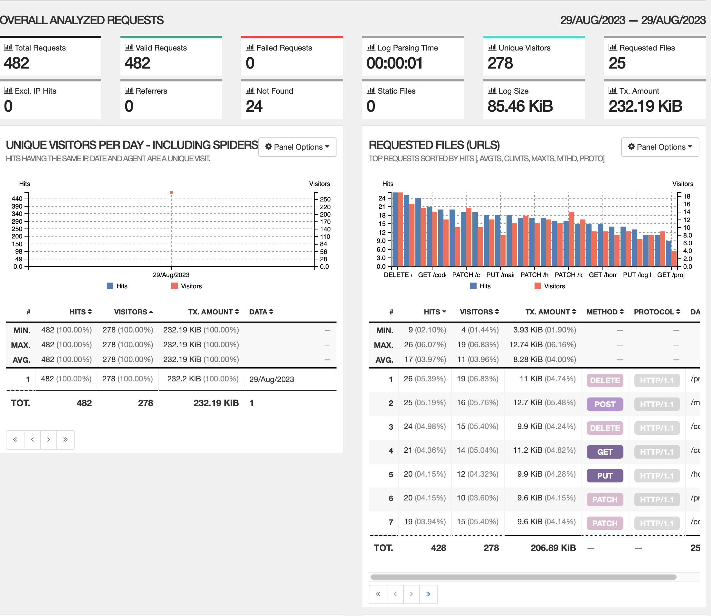
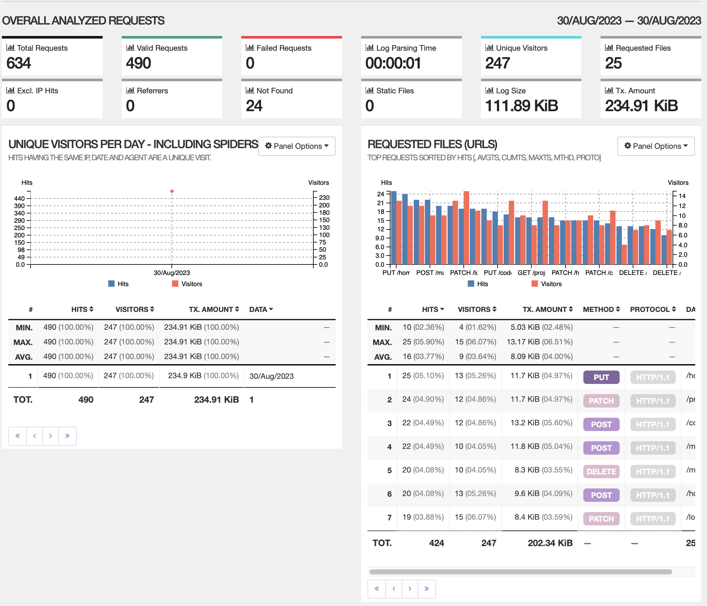
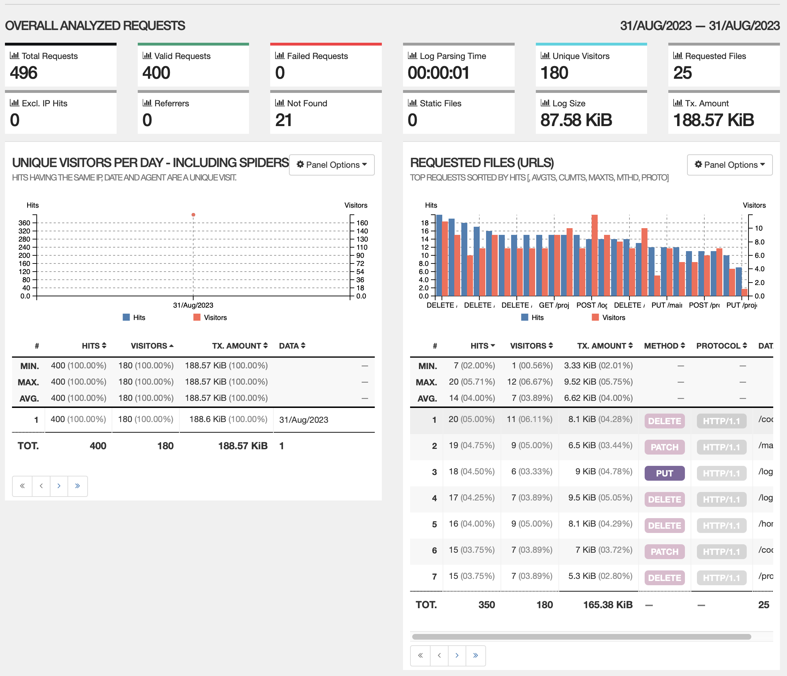

## Установка GoAccess в Ubuntu 20.04.  

### добавление репозитория GoAccess в нашу систему  
>
> echo "deb http://deb.goaccess.io/ $(lsb_release -cs) main" | sudo tee -a /etc/apt/sources.list.d/goaccess.list  
> wget -O - https://deb.goaccess.io/gnugpg.key | sudo apt-key add -  

### установка
>
> sudo apt install goaccess

### запуск  
>
> goaccess /path/logfile.log

### отображение результатов в веб-браузере
>
> sudo goaccess /var/log/apache2/access.log --log-format=COMBINED -a -o /var/www/html/informe.html

## Все записи, отсортированные по коду ответа

    

## Все уникальные IP, встречающиеся в записях

   
 
## Все запросы с ошибками (код ответа - 4хх или 5хх)

   
 
## Все уникальные IP, которые встречаются среди ошибочных запросов

    
