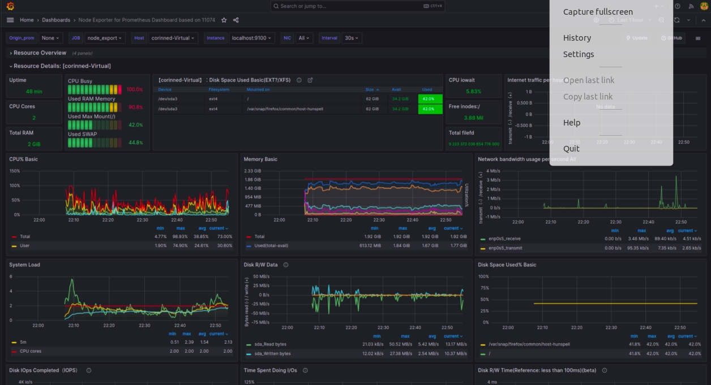

## Установка Prometheus

>Prometheus — система мониторинга, обладающая возможностями тонкой настройки метрик. Она будет полезна для отслеживания состояния работы сервисов на низком уровне.

### Установка вручную:
```
wget https://github.com/prometheus/prometheus/releases/download/v2.44.0/prometheus-2.44.0.linux-amd64.tar.gz
tar -xvf prometheus-2.44.0.linux-amd64.tar.gz
cd prometheus-2.44.0.linux-amd64
```
   


### Проверка:

  

### Раскидываем файлы по ФС, заводим пользователя:
```
sudo cp prometheus promtool /usr/local/bin
sudo mkdir /etc/prometheus /var/lib/prometheus
sudo cp prometheus.yml /etc/prometheus
sudo useradd --no-create-home --home-dir / --shell /bin/false prometheus
sudo chown -R prometheus:prometheus /var/lib/prometheus
```
### Создаём systemd-юнит Prometheus:
```
sudo nano /etc/systemd/system/prometheus.service
```

```
[Unit]
Description=Prometheus
Wants=network-online.target
After=network-online.target

[Service]
User=prometheus
Group=prometheus
Restart=on-failure
ExecStart=/usr/local/bin/prometheus \
  --config.file /etc/prometheus/prometheus.yml \
  --storage.tsdb.path /var/lib/prometheus/
ExecReload=/bin/kill -HUP $MAINPID
ProtectHome=true
ProtectSystem=full

[Install]
WantedBy=default.target
```

```
sudo systemctl daemon-reload
sudo systemctl start prometheus
sudo systemctl status prometheus
```


## Установка node exporter
>Node exporter — небольшое приложение, собирающее метрики операционной системы и предоставляющее к ним доступ по HTTP. Prometheus собирает данные с одного или нескольких экземпляров Node Exporter.
```
wget https://github.com/prometheus/node_exporter/releases/download/v1.6.0/node_exporter-1.6.0.linux-amd64.tar.gz
tar xf node_exporter-*.tar.gz
cd node_exporter-1.6.0.linux-amd64
sudo cp node_exporter /usr/local/bin
sudo useradd --no-create-home --home-dir / --shell /bin/false node_exporter
```
### Создаём systemd-юнит Prometheus Node Exporter:
```
sudo nano /etc/systemd/system/node_exporter.service
```

```
[Unit]
Description=Prometheus Node Exporter
After=network.target

[Service]
Type=simple
User=node_exporter
Group=node_exporter
ExecStart=/usr/local/bin/node_exporter

SyslogIdentifier=node_exporter
Restart=always

PrivateTmp=yes
ProtectHome=yes
NoNewPrivileges=yes

ProtectSystem=strict
ProtectControlGroups=true
ProtectKernelModules=true
ProtectKernelTunables=yes

[Install]
WantedBy=multi-user.target
```
### Запуск сервиса:
```
sudo systemctl daemon-reload
sudo systemctl enable node_exporter
sudo systemctl start node_exporter
sudo systemctl status node_exporter
```


### Установка Alertmanager
>Alertmanager — это про алерты. Первое время алертов у вас не будет, поэтому сейчас его можно не ставить. Но лучше всё-таки поставить, чтобы всё необходимое уже было подготовлено. Идём за дистрибутивом на https://github.com/prometheus/alertmanager/releases.
```
wget https://github.com/prometheus/alertmanager/releases/download/v0.25.0/alertmanager-0.25.0.linux-amd64.tar.gz
tar xf alertmanager-0.25.0.linux-amd64.tar.gz
cd alertmanager-0.25.0.linux-amd64
sudo cp alertmanager amtool /usr/local/bin
sudo mkdir /etc/alertmanager /var/lib/prometheus/alertmanager
sudo cp alertmanager.yml /etc/alertmanager
sudo useradd --no-create-home --home-dir / --shell /bin/false alertmanager
sudo chown -R alertmanager:alertmanager /etc/alertmanager /var/lib/prometheus/alertmanager
chown alertmanager:alertmanager /usr/local/bin/{alertmanager,amtool}
```

### Создаём systemd-юнит alertmanager.service:
```
sudo nano /etc/systemd/system/alertmanager.service
```

```
[Unit]
Description=Alertmanager Service
After=network.target

[Service]
EnvironmentFile=-/etc/default/alertmanager
User=alertmanager
Group=alertmanager
Type=simple
ExecStart=/usr/local/bin/alertmanager \
          --config.file=/etc/alertmanager/alertmanager.yml \
          --storage.path=/var/lib/prometheus/alertmanager \
          $ALERTMANAGER_OPTS
ExecReload=/bin/kill -HUP $MAINPID
Restart=on-failure

[Install]
WantedBy=multi-user.target
```

### Запуск сервиса Alertmanager:
```
sudo systemctl daemon-reload
sudo systemctl enable alertmanager
sudo systemctl start alertmanager
sudo systemctl status alertmanager
```


## Установка Grafana
### Подготовка репозитория:
```
sudo apt-get install -y apt-transport-https
sudo apt-get install -y software-properties-common wget
sudo wget -q -O /usr/share/keyrings/grafana.key https://apt.grafana.com/gpg.key

echo "deb [signed-by=/usr/share/keyrings/grafana.key] https://apt.grafana.com stable main" | sudo tee -a /etc/apt/sources.list.d/grafana.list

echo "deb [signed-by=/usr/share/keyrings/grafana.key] https://apt.grafana.com beta main" | sudo tee -a /etc/apt/sources.list.d/grafana.list
```
### Установка Grafana:
```
# Update the list of available packages
sudo apt-get update

# Install the latest OSS release:
sudo apt-get install grafana
```
curl https://packagecloud.io/gpg.key | sudo apt-key add -
sudo add-apt-repository "deb https://packagecloud.io/grafana/stable/debian/ stretch main"
sudo apt-get update


### Запуск сервиса Grafana:
```
sudo systemctl daemon-reload
sudo systemctl start grafana-server
sudo systemctl status grafana-server
```


>В веб-интерфейсе на странице http://localhost:9090/targets появился первый таргет. Он должен быть в состоянии “UP”.  


### Запустить ваш bash-скрипт из Части 2. Посмотреть на нагрузку жесткого диска (место на диске и операции чтения/записи)   

### Установить утилиту stress и запустить команду `stress -c 2 -i 1 -m 1 --vm-bytes 32M -t 10s`


